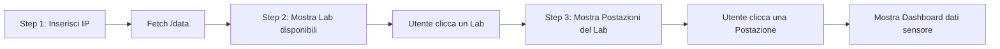

# WeatherStation – Refactor Completo

Refactoring totale dell'app WeatherStation in una dashboard a **3 step progressivi** (IP → Lab → Postazione → Dati), eliminando il form attuale a favore di un flusso guidato e intuitivo.

## Flusso Utente

1. **Step 1 – Connessione**: L'utente inserisce un IP (default: `localhost`). Al click su "Connetti", il sistema fa `fetch http://[IP]:3000/data` e scarica tutti i dati.
2. **Step 2 – Selezione Lab**: Dai dati scaricati, vengono estratti i tag unici dei lab (es. `LAN1`, `LAN2`, `PNRR`). Vengono mostrati come **card cliccabili**.
3. **Step 3 – Selezione Postazione**: Cliccando un lab, vengono mostrate tutte le postazioni disponibili per quel lab (es. 1–30) come **bottoni/chip cliccabili**.
4. **Step 4 – Dashboard Dati**: Cliccando una postazione, si mostrano i dati del sensore (Temperatura, Umidità, Luminosità, Timestamp) in una card elegante.

> [!IMPORTANT]
> **Navigazione a ritroso**: Un pulsante "← Indietro" permetterà di tornare allo step precedente (es. dalla lista postazioni alla lista lab).

## Struttura Dati JSON

Il JSON ha la chiave root `"data"` che contiene un array. Ogni oggetto ha:
- `position`: formato `"LAB-NUMERO"` (es. `"LAN1-1"`, `"LAN2-30"`)
- `temperature`, `humidity`, `luminosity`, `timestamp`

Il codice sarà **robusto**: gestirà sia risposte come array diretto `[...]` sia come oggetto `{"data": [...]}`.

## Proposed Changes

### [MODIFY] [index.html](file:///c:/Users/israk.sarker/Desktop/israk-sarker.github.io/WeatherStation/index.html)
- Struttura HTML minimalista: header + un unico `
` dove il JS renderizza dinamicamente i vari step.
- Nessun `<form>`, nessun `<select>` hardcoded. Tutto generato dal JS.

### [MODIFY] [style.css](file:///c:/Users/israk.sarker/Desktop/israk-sarker.github.io/WeatherStation/style.css)
- Stili per le **lab-card** (card cliccabili per i laboratori)
- Stili per i **desk-chip** (bottoni per le postazioni)
- Stile per il **back-button** e lo **status indicator** (connesso/disconnesso)
- Mantenimento del tema glassmorphism scuro attuale
- Animazioni di transizione tra step

### [MODIFY] [main.js](file:///c:/Users/israk.sarker/Desktop/israk-sarker.github.io/WeatherStation/main.js)
- Riscrittura completa con architettura a **state machine**:
  - `state.currentStep`: `"connect"` | `"labs"` | `"desks"` | `"detail"`
  - `state.allData`: array completo dei dati fetchati
  - `state.selectedLab`: lab selezionato
  - `state.selectedDesk`: postazione selezionata
- Funzione `render()` che in base allo stato corrente renderizza il contenuto giusto dentro `#app`
- Funzioni: `renderConnect()`, `renderLabs()`, `renderDesks()`, `renderDetail()`
- IP di default: `localhost`

### [DELETE] [routes.json](file:///c:/Users/israk.sarker/Desktop/israk-sarker.github.io/WeatherStation/routes.json)
- Non più necessario, si usa direttamente `/data`

## Verification Plan

### Manual Verification
1. Avviare json-server su `localhost:3000`
2. Aprire `localhost:8080`
3. Cliccare "Connetti" → verificare che appaiano le card dei lab (LAN1, LAN2)
4. Cliccare su un lab → verificare che appaiano le postazioni
5. Cliccare su una postazione → verificare che appaia la dashboard con i dati
6. Testare il bottone "Indietro" ad ogni step
7. Testare con IP remoto `192.168.4.45` (se disponibile)
